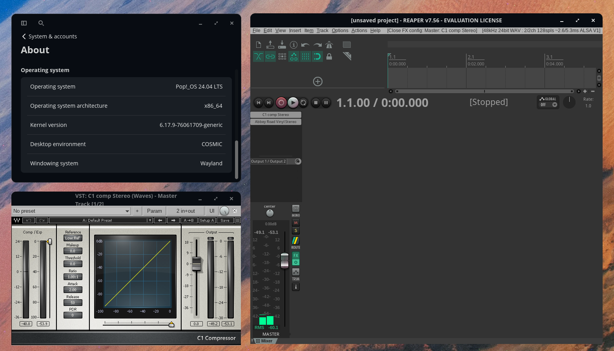

# Waves Plugins on Linux

Setup guide and scripts for running Waves plugins on Linux using Wine and yabridge.



*Waves C1 Compressor plugin successfully running in REAPER v7.56 on Pop!_OS 24.04 LTS*

## ⚠️ Important Legal Notice

**This is an UNOFFICIAL community guide. This project is not affiliated with, endorsed by, or connected to Waves Audio Ltd.**

- This guide documents a method to use Waves plugins you **already own and have licensed**
- You must have a valid Waves license to use these plugins
- This setup requires copying files from a Windows installation where Waves is already installed
- This method is **not officially supported** by Waves
- Use at your own risk

## Quick Start

1. **Prerequisites:**
   - Dual-boot Windows/Linux system (or access to a Windows installation)
   - Wine installed and configured
   - yabridge installed
   - Waves plugins already installed and activated on Windows

2. **Run the setup script:**
   ```bash
   ./setup_waves.sh /path/to/windows/drive
   ```

3. **Or follow the manual guide below**

## What This Repository Contains

- **Complete setup guide** - Step-by-step instructions
- **Automated setup script** - `setup_waves.sh` for easy installation
- **Documentation only** - No Waves software, plugins, or proprietary files

## Important: Copy from Windows (Recommended Method)

**This guide uses the method of copying Waves files from an existing Windows installation.** This is the recommended approach because:

1. **Waves Central has compatibility issues with Wine** - Electron-based apps often crash or fail to start properly in Wine
2. **All files are already installed** - No need to install through Waves Central in Wine
3. **Licenses are preserved** - License files are copied along with the plugins
4. **More reliable** - Avoids installation errors and activation problems

**You need:**
- A Windows installation where Waves plugins are already installed and activated
- Access to that Windows drive from Linux (dual-boot, VM, or external drive)

If you don't have access to a Windows installation, see "Alternative: Fresh Installation" section below, but be aware it may not work due to Waves Central compatibility issues.

## Prerequisites

- Dual-boot Windows/Linux system (or access to a Windows installation)
- Working Wine installation
- yabridge installed and configured
- Waves plugins already installed and activated on Windows

## Step 1: Install Required Dependencies

### Install Wine Dependencies

```bash
# Install Visual C++ Redistributables
winetricks vcrun2013 vcrun2015 vcrun2019

# Install core fonts for GUI rendering
winetricks corefonts allfonts

# Install DXVK for better GUI rendering
winetricks dxvk

# Install network support
winetricks wininet iertutil

# Install additional dependencies
winetricks d3dx11_42 d3dx11_43 gdiplus mfc42
```

### Set Wine Version

```bash
# Set Wine to Windows 10 (or Windows 7 for better Electron compatibility)
winecfg -v win10
```

## Step 2: Configure Wine Environment Variables

Waves Central requires specific environment variables that aren't set by default in Wine:

```bash
# Set COMMONPROGRAMFILES(X86)
wine reg add "HKEY_CURRENT_USER\Environment" /v "COMMONPROGRAMFILES(X86)" /t REG_SZ /d "C:\Program Files (x86)\Common Files" /f

# Set PROGRAMFILES(X86)
wine reg add "HKEY_CURRENT_USER\Environment" /v "PROGRAMFILES(X86)" /t REG_SZ /d "C:\Program Files (x86)" /f

# Set PUBLIC
wine reg add "HKEY_CURRENT_USER\Environment" /v "PUBLIC" /t REG_SZ /d "C:\users\Public" /f
```

## Step 3: Configure DLL Overrides

Set DLL overrides for better compatibility:

```bash
# Set DLL overrides
wine reg add "HKEY_CURRENT_USER\Software\Wine\DllOverrides" /v "mscoree" /t REG_SZ /d "native,builtin" /f
wine reg add "HKEY_CURRENT_USER\Software\Wine\DllOverrides" /v "mshtml" /t REG_SZ /d "native,builtin" /f
wine reg add "HKEY_CURRENT_USER\Software\Wine\DllOverrides" /v "dwrite" /t REG_SZ /d "native,builtin" /f
wine reg add "HKEY_CURRENT_USER\Software\Wine\DllOverrides" /v "d2d1" /t REG_SZ /d "native,builtin" /f
wine reg add "HKEY_CURRENT_USER\Software\Wine\DllOverrides" /v "iertutil" /t REG_SZ /d "native,builtin" /f
wine reg add "HKEY_CURRENT_USER\Software\Wine\DllOverrides" /v "mfc140" /t REG_SZ /d "native,builtin" /f
wine reg add "HKEY_CURRENT_USER\Software\Wine\DllOverrides" /v "mfc42" /t REG_SZ /d "native,builtin" /f
wine reg add "HKEY_CURRENT_USER\Software\Wine\DllOverrides" /v "mfc42u" /t REG_SZ /d "native,builtin" /f
wine reg add "HKEY_CURRENT_USER\Software\Wine\DllOverrides" /v "nsi" /t REG_SZ /d "native,builtin" /f
```

## Step 4: Install PowerShell for Wine

Waves Central requires PowerShell. Install it using one of these methods:

### Method 1: PowerShell Wrapper (Recommended if it works)

```bash
# Download PowerShell wrapper installer
cd /tmp
wget https://github.com/PietJankbal/powershell-wrapper-for-wine/raw/master/install_pwshwrapper.exe

# Install (may crash in some Wine versions - see Method 2)
WINEPREFIX=~/.wine wine /tmp/install_pwshwrapper.exe
```

### Method 2: Manual PowerShell Installation

If the wrapper installer crashes, install PowerShell manually:

```bash
# Download PowerShell MSI
cd /tmp
wget https://github.com/PowerShell/PowerShell/releases/download/v7.4.0/PowerShell-7.4.0-win-x64.msi -O PowerShell.msi

# Install via MSI
WINEPREFIX=~/.wine wine msiexec /i /tmp/PowerShell.msi /quiet

# Create symlink
ln -sf ~/.wine/drive_c/Program\ Files/PowerShell/7/pwsh.exe ~/.wine/drive_c/windows/system32/powershell.exe

# Create wrapper script
echo 'start /unix "/home/$USER/.wine/drive_c/Program Files/PowerShell/7/pwsh.exe" %*' > ~/.wine/drive_c/windows/system32/powershell.cmd
chmod +x ~/.wine/drive_c/windows/system32/powershell.cmd
```

## Step 5: Copy Waves Files from Windows (PRIMARY METHOD)

**This is the main method used in this guide.** We copy all Waves files from an existing Windows installation. This avoids the need to install Waves Central in Wine, which often fails due to Electron compatibility issues.

**Important:** This step requires access to your Windows installation where Waves plugins are already installed and activated.

### Mount Windows Drive

```bash
# Mount your Windows drive (adjust device and mount point as needed)
sudo mkdir -p /mnt/windows
sudo mount -t ntfs3 /dev/nvme0n1p3 /mnt/windows  # Adjust device path
```

### Copy All Waves Files

Copy the following directories from Windows to Wine:

```bash
# Set Windows mount path (adjust to your actual path)
WINDOWS_PATH="/mnt/windows"  # or "/media/username/DRIVE_LABEL"

# Copy Waves Central
mkdir -p ~/.wine/drive_c/Program\ Files
cp -rv "$WINDOWS_PATH/Program Files/Waves Central" ~/.wine/drive_c/Program\ Files/

# Copy Waves plugins and data
mkdir -p ~/.wine/drive_c/Program\ Files\ \(x86\)
cp -rv "$WINDOWS_PATH/Program Files (x86)/Waves" ~/.wine/drive_c/Program\ Files\ \(x86\)/

# Copy ProgramData
mkdir -p ~/.wine/drive_c/ProgramData
cp -rv "$WINDOWS_PATH/ProgramData/Waves Audio" ~/.wine/drive_c/ProgramData/

# Copy User AppData Local
mkdir -p ~/.wine/drive_c/users/$USER/AppData/Local
cp -rv "$WINDOWS_PATH/Users/$USER/AppData/Local/Waves Audio" ~/.wine/drive_c/users/$USER/AppData/Local/

# Copy User AppData Roaming
mkdir -p ~/.wine/drive_c/users/$USER/AppData/Roaming
cp -rv "$WINDOWS_PATH/Users/$USER/AppData/Roaming/Waves Audio" ~/.wine/drive_c/users/$USER/AppData/Roaming/

# Copy Public Documents
mkdir -p ~/.wine/drive_c/users/Public
cp -rv "$WINDOWS_PATH/Users/Public/Waves Audio" ~/.wine/drive_c/users/Public/ 2>/dev/null || true

# Copy VST3 WaveShells
mkdir -p ~/.wine/drive_c/Program\ Files/Common\ Files/VST3
cp -v "$WINDOWS_PATH/Program Files/Common Files/VST3/WaveShell"* ~/.wine/drive_c/Program\ Files/Common\ Files/VST3/

# Copy VST2 WaveShells
mkdir -p ~/.wine/drive_c/Program\ Files/VSTPlugins
cp -v "$WINDOWS_PATH/Program Files/VSTPlugIns/WaveShell"* ~/.wine/drive_c/Program\ Files/VSTPlugins/
```

**Note:** Replace `$USER` with your actual Windows username, or use the full path like `/mnt/windows/Users/YourUsername/`.

**Or use the automated script:**
```bash
./setup_waves.sh /path/to/windows/drive
```

## Step 6: Install Waves Central (Alternative Method - May Not Work)

**Note:** This method often fails due to Electron/Wine compatibility issues. The recommended approach is to copy files from Windows (Step 5).

If you don't have Windows files to copy, you can try downloading and installing Waves Central:

```bash
# Download Waves Central installer
cd ~/Downloads
wget https://downloads.waves.com/WavesCentral/v13_5_3/Install_Waves_Central.exe

# Install
WINEPREFIX=~/.wine wine ~/Downloads/Install_Waves_Central.exe
```

## Step 7: Start Waves Local Server

Waves Local Server handles license management:

```bash
# Start Waves Local Server
cd ~/.wine/drive_c/ProgramData/Waves\ Audio/WavesLocalServer/WavesLocalServer.bundle/Contents/Win64
WINEPREFIX=~/.wine WINEDEBUG=-all wine WavesLocalServer.exe &
```

## Step 8: Run Waves Central

```bash
# Run Waves Central
cd ~/.wine/drive_c/Program\ Files/Waves\ Central
WINEPREFIX=~/.wine WINEDEBUG=-all DISPLAY=:0 wine "Waves Central.exe" &
```

**Troubleshooting:** If Waves Central doesn't start, try:

```bash
# With virtual desktop
WINEPREFIX=~/.wine WINEDEBUG=-all wine explorer /desktop=WavesCentral,1920x1080 "Waves Central.exe" &

# With network flags
WINEPREFIX=~/.wine WINEDEBUG=-all DISPLAY=:0 wine "Waves Central.exe" --disable-background-networking --disable-background-timer-throttling &
```

## Step 9: Activate Plugins in Waves Central

**If you copied files from Windows:** Your plugins may already be activated! The license files should have been copied along with the plugins. Try loading them in your DAW first before attempting activation.

**If activation is needed:**

1. **Login:** Open Waves Central and log in with your Waves account
   - **Note:** If login fails, you may need to use deb Firefox instead of snap Firefox
   - Snap Firefox has sandbox issues that prevent communication with Waves Central

2. **Activate Plugins:**
   - Go to "Licenses" tab
   - Select plugins you want to activate
   - Click "Activate"
   - **Important:** Activate to "Windows 10" (not USB drive)

## Step 10: Sync Plugins with yabridge

After installation and activation, sync plugins with yabridge:

```bash
# Sync all plugins
yabridgectl sync

# Check status
yabridgectl status | grep -i waves
```

You should see your WaveShell plugins listed:
```
WaveShell1-VST3 13.0_x64.vst3 :: VST3, legacy, 64-bit, synced
WaveShell1-VST 13.0_x64.dll :: VST2, 64-bit, synced
```

## Step 11: Test in Your DAW

1. Open your DAW (Reaper, Ardour, etc.)
2. Rescan/refresh your plugin list
3. Look for "WaveShell" entries
4. Load a Waves plugin and test it

## Setup Script Usage

The repository includes an automated setup script with many features:

```bash
# Basic usage
./setup_waves.sh /mnt/windows

# With verbose output
./setup_waves.sh /media/user/Windows --verbose

# Dry run (see what would happen)
./setup_waves.sh /mnt/windows --dry-run

# Custom Wine prefix
./setup_waves.sh --wine-prefix ~/.wine-custom /mnt/windows

# Show help
./setup_waves.sh --help
```

## Known Issues and Limitations

### Known Problems

1. **Waves Central Crashes:**
   - Electron apps have compatibility issues with Wine
   - Network errors (`WSALookupServiceBegin failed`)
   - Window handle errors (`hwnd_util fatal error`)
   - **Solution:** Copy files from Windows instead of installing via Waves Central

2. **Login Issues:**
   - Snap Firefox doesn't work with Waves Central
   - **Solution:** Use deb Firefox or another browser

3. **Plugin Stability:**
   - Waves V13 VST3 plugins may have memory issues
   - Preset browser may cause crashes
   - Some plugins may not appear in the list
   - **Solution:** Use VST2 versions when possible

4. **Wineserver Hanging:**
   - Waves keeps wineserver running after closing DAW
   - **Solution:** Run `wineserver -k` after closing your DAW

### Browser Compatibility

If Waves Central login fails:

```bash
# Check if Firefox is snap version
which firefox
firefox --version

# If it's snap, uninstall and install deb version:
sudo snap remove firefox
sudo apt install firefox
```

## Quick Reference Commands

```bash
# Start Waves Central
cd ~/.wine/drive_c/Program\ Files/Waves\ Central
WINEPREFIX=~/.wine WINEDEBUG=-all DISPLAY=:0 wine "Waves Central.exe" &

# Start Waves Local Server
cd ~/.wine/drive_c/ProgramData/Waves\ Audio/WavesLocalServer/WavesLocalServer.bundle/Contents/Win64
WINEPREFIX=~/.wine wine WavesLocalServer.exe &

# Sync plugins
yabridgectl sync

# Check plugin status
yabridgectl status | grep waves

# Kill all Waves processes
killall -9 "Waves Central.exe" "WavesLocalServer.exe"
wineserver -k
```

## File Structure

After setup, your Wine directory should contain:

```
~/.wine/drive_c/
├── Program Files/
│   ├── Waves Central/
│   └── Common Files/VST3/
│       └── WaveShell*.vst3
├── Program Files (x86)/
│   └── Waves/
│       ├── Plug-Ins V13/
│       ├── WaveShells V13/
│       └── Data/
├── ProgramData/
│   └── Waves Audio/
│       ├── Modules/
│       ├── Preset Browser/
│       └── WavesLocalServer/
├── users/
│   └── $USER/
│       └── AppData/
│           ├── Local/Waves Audio/
│           └── Roaming/Waves Audio/
└── VSTPlugins/
    └── WaveShell*.dll
```

## Troubleshooting

### Waves Central Won't Start

1. Check Wine version: `wine --version`
2. Verify DLL overrides: `wine reg query "HKEY_CURRENT_USER\Software\Wine\DllOverrides"`
3. Check environment variables: `wine reg query "HKEY_CURRENT_USER\Environment"`
4. Try Windows 7 instead of Windows 10: `winecfg -v win7`

### Plugins Don't Appear in DAW

1. Verify sync: `yabridgectl status`
2. Re-sync: `yabridgectl sync`
3. Check plugin paths in DAW settings
4. Verify files exist: `ls ~/.wine/drive_c/Program\ Files/Common\ Files/VST3/WaveShell*`

### Activation Errors

1. Ensure you're logged into Waves Central
2. Activate to "Windows 10" not USB
3. Check license files: `ls ~/.wine/drive_c/ProgramData/Waves\ Audio/Licenses/`
4. Restart Waves Local Server

### Performance Issues

1. Use VST2 instead of VST3 when possible
2. Avoid preset browser (known to cause crashes)
3. Close Waves Central after activation (not needed for plugin use)

## Additional Resources

- [yabridge GitHub](https://github.com/robbert-vdh/yabridge)
- [Wine Application Database](https://appdb.winehq.org/)
- [Waves Community Forum](https://forum.waves.com/)
- [LinuxMusicians Forum](https://linuxmusicians.com/)

## License

This documentation and scripts are provided as-is for educational purposes. Waves plugins themselves remain property of Waves Audio Ltd. and are subject to their own licensing terms.

## Disclaimer

Running Waves plugins on Linux via Wine is not officially supported by Waves. Success may vary based on system configuration. This guide is provided for informational purposes only.

## Notes

- This setup is **not officially supported** by Waves
- Success may vary based on system configuration
- Always backup your Wine prefix before making changes
- Consider native Linux alternatives when possible

---

**Last Updated:** December 2025  
**Tested With:** Wine 9.0, yabridge, Waves V13 plugins
